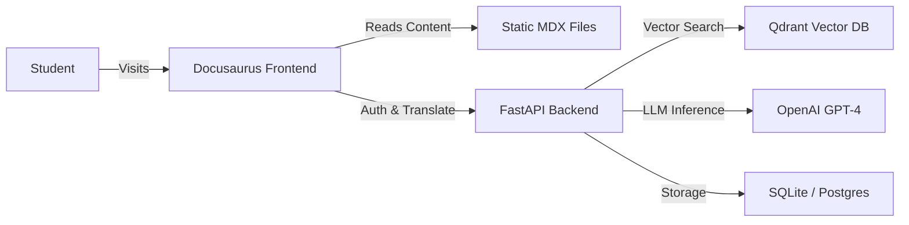

# 🤖 Physical AI & Humanoid Robotics Platform

> **Bridging the gap between the digital brain and the physical body.**

This project is a comprehensive educational platform designed to teach **Physical AI** and **Humanoid Robotics**. It combines a modern, interactive learning frontend with a powerful AI-driven backend to deliver a cutting-edge learning experience.

---

## 🚀 Live Demo

-   **Frontend (Course Site):** [https://DevAbdullah90.github.io/Spec-Driven-Development-Hackathon-I/](https://DevAbdullah90.github.io/Spec-Driven-Development-Hackathon-I/)
-   **Backend (API Docs):** [https://abdullah9873-physical-ai-backend.hf.space/docs](https://abdullah9873-physical-ai-backend.hf.space/docs)

---

## 🏗️ System Architecture

The application follows a decoupled **Client-Server** architecture:



### 1. 🎨 Frontend (The Learning Hub)
**Tech Stack:** React, Docusaurus, TypeScript, CSS Modules.

The frontend is more than just static documentation. It is an **Interactive Learning Environment (ILE)** featuring:
*   **📚 Interactive Books:** A custom reading experience with "Focus Mode", progress tracking, and embedded quizzes.
*   **🔐 Auth Gate:** A static authentication gate ensures only authorized students access premium content.
*   **🧠 Embedded Quizzes:** Real-time knowledge checks built with React components.
*   **🌍 Multi-Language Support:** On-the-fly content translation powered by the backend.
*   **🎥 Multimedia Integration:** Seamlessly embedded videos and dynamic diagrams.

### 2. ⚙️ Backend (The Brain)
**Tech Stack:** Python, FastAPI, SQLAlchemy, OpenAI, Qdrant.

The backend provides the intelligence and state management:
*   **🤖 RAG Pipeline (Retrieval Augmented Generation):** Allows students to "chat" with the course content. It retrieves relevant chunks from the vector database (Qdrant) and answers questions using OpenAI.
*   **🗣️ Translation Engine:** A dedicated endpoint (`/translate-text`) that uses advanced NLP models to translate course material into native languages (e.g., Urdu) while preserving context.
*   **📚 Content API:** Serves book metadata, chapters, and tracks user progress (roadmap).
*   **☁️ Deployment:** Containerized with **Docker** and hosted on **Hugging Face Spaces** for high availability and GPU access if needed.

---

## 🔄 How It Works (The Flow)

1.  **User Arrival:** The user lands on the high-performance Hero Section (optimized 3D visuals/images).
2.  **Authentication:** When accessing a "Book", the user is prompted to log in. The frontend validates this via a static gate (for demo purposes) or calls the backend auth service.
3.  **Reading:** The user reads `MDX` content served by Docusaurus.
4.  **Interaction:**
    *   **Quiz:** The user selects an answer. React state handles the immediate feedback (Green/Red).
    *   **Translation:** The user clicks "Translate". The frontend sends the raw text to the Backend API (`POST /books/{id}/translate`). The backend processes this via `DeepTranslator` or `OpenAI`, saves the result to the DB, and returns the localized text.
    *   **Chat:** (If enabled) The user asks a question. The backend searches the Qdrant vector store for course context and generates an answer.

---

## 🛠️ Local Development Setup

### Prerequisites
*   Node.js (v18+)
*   Python (v3.10+)
*   Git

### 1. Clone the Repository
```bash
git clone https://github.com/DevAbdullah90/Spec-Driven-Development-Hackathon-I.git
cd Spec-Driven-Development-Hackathon-I
```

### 2. Frontend Setup
```bash
# Install dependencies
npm install

# Start the local server
npm start
```
The site will open at `http://localhost:3000`.

### 3. Backend Setup
```bash
cd backend

# Create virtual environment
python -m venv venv
source venv/bin/activate  # On Windows: venv\Scripts\activate

# Install dependencies
pip install -r requirements.txt

# Set up environment variables
cp .env.example .env
# (Edit .env with your OpenAI and Qdrant keys)

# Run the server
uvicorn src.main:app --reload

  cd auth-server

```
The API will run at `http://localhost:8000`.

---

## 📦 Deployment

*   **Frontend:** Deployed to **GitHub Pages** via `npm run deploy`.
*   **Backend:** Deployed to **Hugging Face Spaces** (Docker SDK).

## 📝 License
MIT License. Built for the Spec-Driven Development Hackathon.